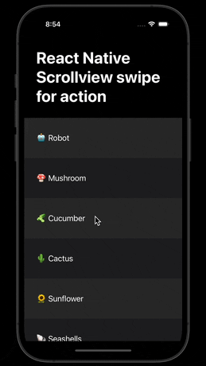

# React Native Swipe Sideways for Contextual Actions



The is the code for the tutorial in the article [📱React Native — Lists with swipe sideways for action](https://medium.com/stackademic/react-native-lists-with-swipe-sideways-for-action-145bb617a037)

# How to install and run it

```bash
# iOS
yarn && npx pod-install && yarn ios

# or Android
yarn && yarn android
```
